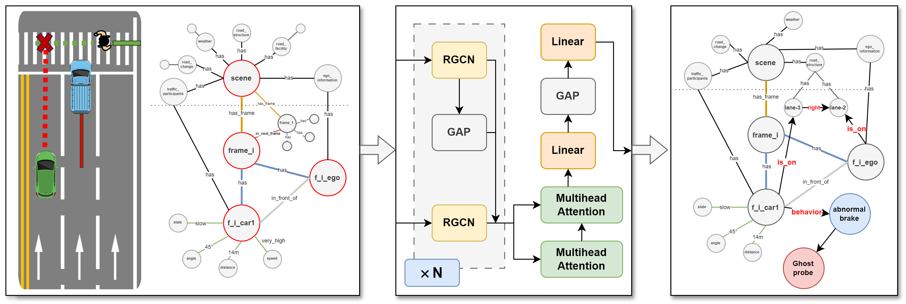

### KG & RGCN
A Temporal Knowledge Graphs Based RGCN Approach And Dataset for Predicting Potential Dangers in Autonomous Driving

We propose a novel, knowledge-driven framework that enables autonomous vehicles to proactively anticipate hidden risks—such as "ghost probe" incidents—by modeling driving scenarios as Temporal Knowledge Graphs (TKGs) and reasoning over them using a global feature-enhanced Relational Graph Convolutional Network (RGCN). Our method predicts potential hazards 0.4–0.8 seconds before they manifest, and provides interpretable, entity-level risk attribution and actionable decision recommendations.

## Introducion

